# Project Report - News App (Publish Article Feature)

**Author:** Edgar Anco
**Date:** January 18, 2026
**Project Duration:** 1-2 days

---

## 1. Introduction

When I first encountered this project, I was genuinely excited about the opportunity to work on a real-world application that combines multiple modern technologies. The News App presented an interesting challenge: implementing a complete "Publish Article" feature that would allow users to create and share their own articles, transforming from passive readers into active content creators.

Having intermediate experience with Flutter, Firebase, and the BLoC pattern, I felt confident in my ability to tackle this project while also recognizing it as an opportunity to deepen my understanding of Clean Architecture principles and their practical application.

The project's emphasis on Symmetry's core values - Truth is King, Total Accountability, and Maximally Overdeliver - resonated with me and motivated me to not just meet the requirements but to exceed them wherever possible.

---

## 2. Learning Journey

### Technologies Applied

Although I had prior experience with the core technologies, this project allowed me to strengthen my knowledge in several areas:

#### Flutter & Dart
- Deepened understanding of widget composition and state management
- Improved skills in form validation and user input handling
- Learned best practices for image picking and file handling

#### Firebase Integration
- **Firestore**: Implemented document creation, querying with ordering, and real-time data synchronization
- **Cloud Storage**: Managed image uploads with proper metadata and URL retrieval
- **Security Rules**: Created validation rules to enforce data integrity at the database level

#### BLoC Pattern
- Implemented new BLoCs following the established patterns in the codebase
- Created proper event/state classes with Equatable for efficient state comparison
- Managed asynchronous operations and error handling within the BLoC

#### Clean Architecture
- Followed the Domain-Data-Presentation layer separation rigorously
- Created use cases that encapsulate business logic
- Implemented repository pattern for data abstraction

### Resources Utilized

- Official Flutter documentation
- Firebase documentation for Firestore and Cloud Storage
- BLoC library documentation
- The project's existing documentation (`APP_ARCHITECTURE.md`, `ARCHITECTURE_VIOLATIONS.md` and `CODING_GUIDELINES.md`)

---

## 3. Challenges Faced

### Challenge 1: Dependency Version Conflicts

**The Problem:**
The most significant challenge was dealing with dependency conflicts when trying to add testing libraries (`mockito` and `bloc_test`). The project uses older pinned versions of several packages:
- `retrofit_generator: 3.0.1+1`
- `build_runner: 2.1.2`

These versions require older versions of `analyzer` that are incompatible with modern testing libraries.

**The Solution:**
Instead of forcing dependency upgrades that could break existing functionality, I implemented **manual mocks** for testing:

```dart
// Manual mock implementation instead of @GenerateMocks
class MockArticleRepository implements ArticleRepository {
  DataState<ArticleEntity>? publishArticleResult;

  @override
  Future<DataState<ArticleEntity>> publishArticle({...}) async {
    return publishArticleResult!;
  }
  // ... other methods
}
```

This approach allowed me to write effective unit tests without disrupting the project's dependency structure.

**Lesson Learned:**
Sometimes the best solution isn't the most elegant one. Pragmatic problem-solving that maintains system stability is more valuable than forcing "ideal" solutions that introduce risk.

### Challenge 2: State Management for Form Submission

**The Problem:**
Managing the publish flow states (initial, loading, success, error) while providing good UX feedback.

**The Solution:**
Implemented a dedicated `PublishArticleBloc` with clear state transitions and used `BlocConsumer` to handle both UI updates and side effects (like showing success dialogs).

---

## 4. Reflection and Future Directions

### Technical Learnings

1. **Clean Architecture Benefits**: The separation of concerns made it straightforward to add new features. The domain layer remained untouched by implementation details.

2. **BLoC Pattern Strengths**: Having predictable state transitions made debugging easier and the code more testable.

3. **Firebase Power**: The combination of Firestore and Cloud Storage provides a robust backend with minimal setup.

### Professional Growth

- Improved ability to work within existing codebases and follow established patterns
- Enhanced problem-solving skills when dealing with technical constraints
- Strengthened documentation habits through creating the implementation guide

### Future Improvement Ideas

1. **Authentication**: Add Firebase Auth to associate articles with user accounts
2. **Article Editing/Deletion**: Allow users to modify or remove their published articles
3. **Categories & Tags**: Implement article categorization for better organization
4. **Search Functionality**: Add full-text search across articles
5. **Social Features**: Add likes, comments, and sharing capabilities

---

## 5. Proof of the Project

### Screenshots

#### Home Screen with FAB
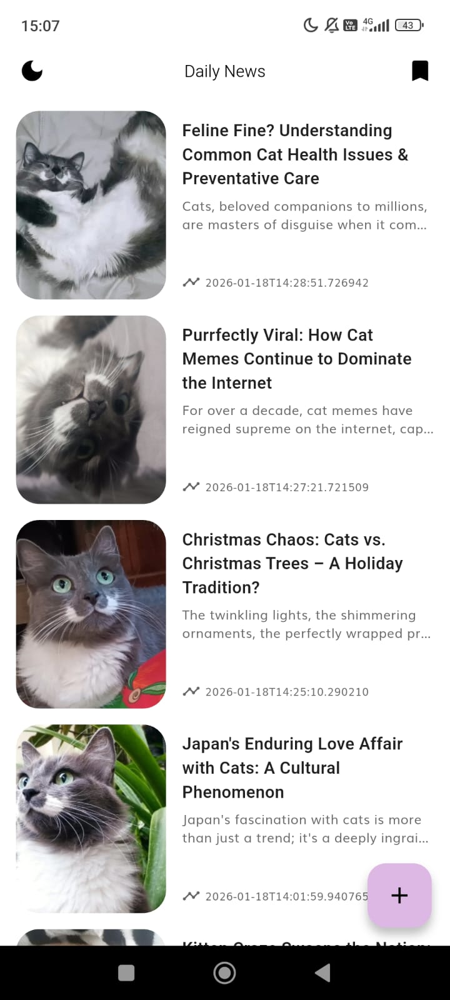
*The home screen displays articles from Firestore with a floating action button to publish new articles.*

#### Publish Article Form
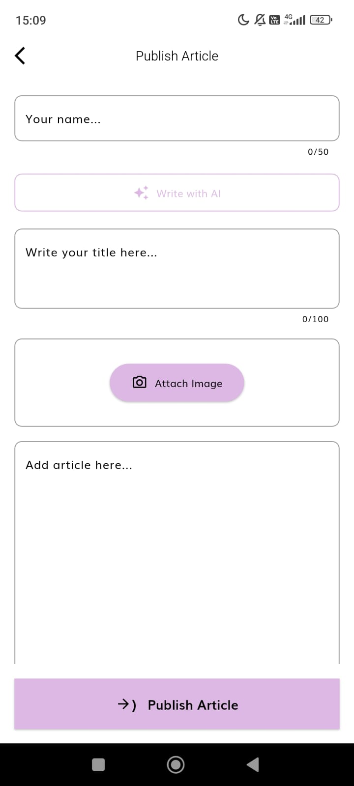
*The publish article form with author name, title, image attachment, and content fields.*

#### Image Selection
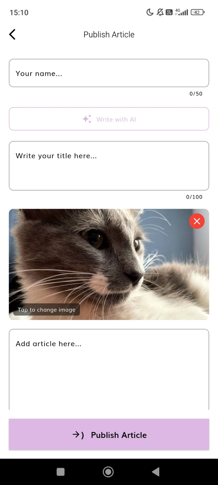
*Users can attach images from their gallery as article thumbnails.*

#### Publishing State
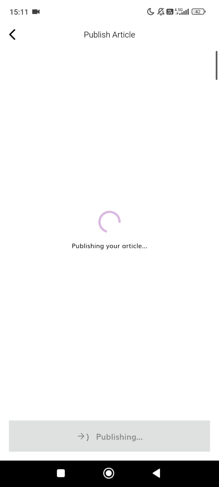
*Loading overlay shown while the article is being published to Firestore.*

#### Success Dialog
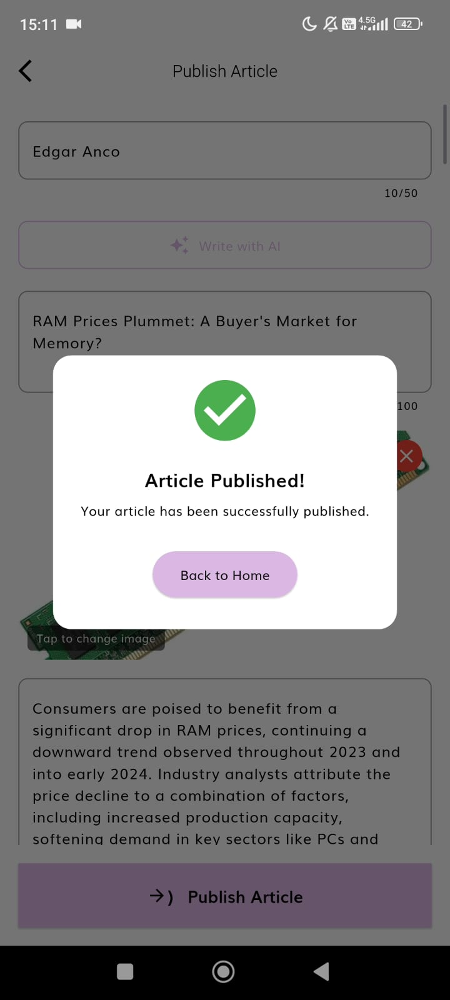
*Confirmation dialog displayed after successful article publication.*

#### Article in Feed
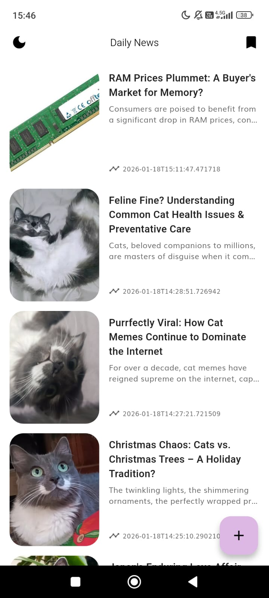
*Published article appearing in the home feed with other articles.*

### Video Demo

A video demonstration of the complete publish flow is available at:
`docs/images/publish_demo.mp4`

---

## 6. Overdelivery

### 6.1 New Features Implemented

#### Dark Mode
**Files:**
- `frontend/lib/features/daily_news/presentation/bloc/theme/theme_cubit.dart`
- `frontend/lib/features/daily_news/presentation/bloc/theme/theme_state.dart`
- `frontend/lib/config/theme/app_themes.dart`

Implemented a complete dark mode system with:
- Toggle button in the app bar for switching between light and dark themes
- Local persistence using SharedPreferences to remember user preference
- Consistent theming across all screens and components
- Smooth theme transitions

**Challenge:** Encountered dependency conflicts when integrating SharedPreferences with the existing architecture. Resolved by ensuring proper initialization order in the dependency injection container.

**Purpose:** Improves user experience by providing a comfortable viewing option in low-light environments and respecting user preferences.

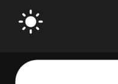
*Toggle button in the app bar allows users to switch between light and dark themes.*

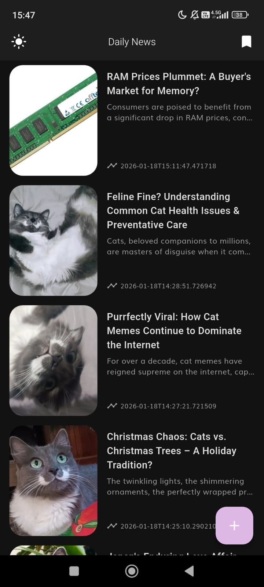
*Home screen displayed in dark mode.*

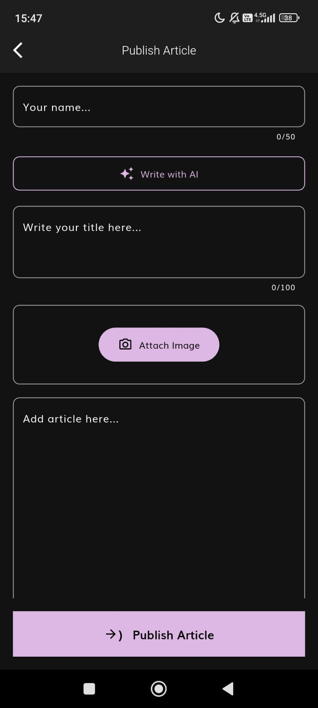
*Publish article page in dark mode.*

---

#### AI-Assisted Article Writing (Write with AI)
**Files:**
- `frontend/lib/features/daily_news/domain/entities/article_suggestion.dart`
- `frontend/lib/features/daily_news/domain/repository/ai_repository.dart`
- `frontend/lib/features/daily_news/domain/usecases/generate_article_suggestions.dart`
- `frontend/lib/features/daily_news/data/data_sources/remote/gemini_service.dart`
- `frontend/lib/features/daily_news/data/repository/ai_repository_impl.dart`
- `frontend/lib/features/daily_news/presentation/bloc/article/ai_suggestion/ai_suggestion_bloc.dart`
- `frontend/lib/features/daily_news/presentation/widgets/ai_suggestion_dialog.dart`

Implemented an AI-powered article generation feature using Google's Gemini API:
- "Write with AI" button in the publish article page
- Modal dialog for entering article draft/idea (minimum 20 characters, maximum 500)
- AI generates suggested title (max 100 chars) and content (max 5000 chars)
- Generated content automatically fills the form fields
- Loading state with spinner during generation
- Error handling with user-friendly messages
- Writes in the same language as the user's input

**Why Gemini API?** Chose Gemini because of prior experience implementing it in other projects, and it belongs to Google's ecosystem (same as Firebase), ensuring consistent integration patterns and reliability.

**Architecture:** Followed Clean Architecture principles with:
- Domain layer: Entity, Repository interface, UseCase, Params
- Data layer: GeminiService (API calls), AiRepositoryImpl
- Presentation layer: BLoC (events, states), Dialog widget

**Purpose:** Helps users overcome writer's block by generating article suggestions based on their ideas, making content creation faster and more accessible.


*"Write with AI" button displayed in the publish article form.*

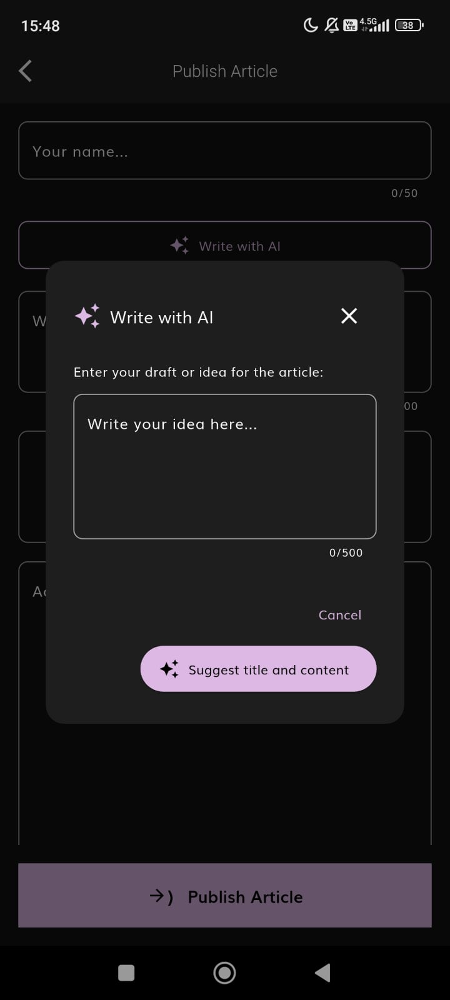
*Dialog for entering article draft/idea with character counter.*

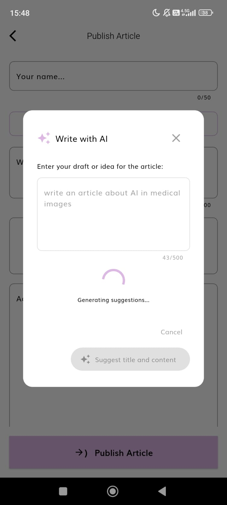
*Loading state while Gemini generates suggestions.*

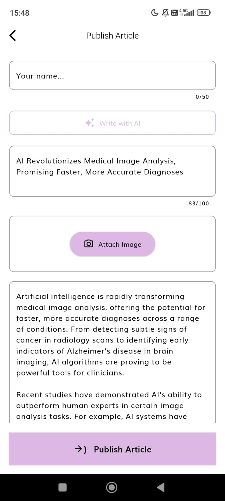
*Form fields automatically filled with AI-generated title and content.*

---

#### Character Counter Widget
**File:** `frontend/lib/features/daily_news/presentation/widgets/character_counter_field.dart`

A reusable text field widget that provides visual feedback on character count:
- Displays current/max character count
- Color changes based on usage percentage:
  - Gray: < 75%
  - Orange: 75-90%
  - Red (bold): > 90%
- Hides default Flutter counter for custom styling

**Purpose:** Enhances UX by giving users clear feedback on input limits, preventing frustration from hitting character limits unexpectedly.

#### Loading Overlay Widget
**File:** `frontend/lib/features/daily_news/presentation/widgets/loading_overlay.dart`

A reusable overlay component for loading states:
- Semi-transparent background to indicate processing
- Centered card with spinner and optional message
- Prevents user interaction during loading

**Purpose:** Provides consistent loading feedback across the app, improving perceived performance and preventing double-submissions.

#### Pull-to-Refresh
**Location:** `frontend/lib/features/daily_news/presentation/pages/home/daily_news.dart`

Implemented RefreshIndicator for the article list:
- Themed with app's primary color (#DDB8E4)
- Triggers article refresh from Firestore
- Familiar gesture for mobile users

**Purpose:** Allows users to manually refresh content, giving them control over data freshness.

#### Unit Tests with Manual Mocks
**Files:**
- `frontend/test/features/daily_news/domain/usecases/publish_article_test.dart`
- `frontend/test/features/daily_news/presentation/bloc/publish_article_bloc_test.dart`
- `frontend/test/features/daily_news/domain/usecases/generate_article_suggestions_test.dart`
- `frontend/test/features/daily_news/presentation/bloc/ai_suggestion_bloc_test.dart`

Implemented comprehensive unit tests using manual mock implementations to overcome dependency conflicts:
- Tests for `PublishArticleUseCase` (success and null params cases)
- Tests for `PublishArticleBloc` (initial state, publish flow, reset state)
- Tests for `GenerateArticleSuggestionsUseCase` (success, null params, draft passing)
- Tests for `AiSuggestionBloc` (initial state, generation flow, reset state)

**Purpose:** Ensures code reliability and provides documentation of expected behavior, demonstrating commitment to code quality despite technical constraints.

### 6.2 Prototypes Created

#### Database Schema Documentation
**File:** `backend/docs/DB_SCHEMA.md`

Created comprehensive documentation for the Firestore database schema:
- Article collection structure with all fields and types
- Field constraints and validation rules
- Cloud Storage structure for media files
- Data flow diagrams

**Purpose:** Provides clear documentation of the data model, making it easier for future developers to understand and extend the database structure.

---

#### Architecture Diagram
Created a visual representation of the application's Clean Architecture implementation:

```
┌──────────────────────────────────────────────────────────────────────────┐
│                           PRESENTATION LAYER                             │
│  ┌─────────────┐  ┌─────────────┐  ┌──────────────┐  ┌────────────────┐  │
│  │ DailyNews   │  │ PublishPage │  │ArticleDetails│  │AiSuggestion    │  │
│  │   Page      │  │             │  │              │  │   Dialog       │  │
│  └──────┬──────┘  └──────┬──────┘  └──────────────┘  └──────┬─────────┘  │
│         │                │                                  │            │
│  ┌──────▼──────┐  ┌──────▼──────┐  ┌────────────┐  ┌────────▼────────┐   │
│  │ RemoteBloc  │  │ PublishBloc │  │ ThemeCubit │  │AiSuggestionBloc │   │
│  └──────┬──────┘  └──────┬──────┘  └──────┬─────┘  └────────┬────────┘   │
└─────────┼────────────────┼────────────────┼─────────────────┼────────────┘
          │                │                │                 │
┌─────────▼────────────────▼────────────────┼─────────────────▼───────────┐
│                      DOMAIN LAYER         │                             │
│  ┌─────────────────┐  ┌───────────────┐   │   ┌─────────────────────┐   │
│  │ GetFirestore    │  │ PublishArticle│   │   │ GenerateArticle     │   │
│  │ ArticlesUseCase │  │ UseCase       │   │   │ SuggestionsUseCase  │   │
│  └────────┬────────┘  └───────┬───────┘   │   └──────────┬──────────┘   │
│           │                   │           │              │              │
│           └─────────┬─────────┘           │              │              │
│                     │                     │              │              │
│           ┌─────────▼─────────┐           │    ┌─────────▼─────────┐    │
│           │ ArticleRepository │           │    │   AiRepository    │    │
│           │    (Interface)    │           │    │   (Interface)     │    │
│           └─────────┬─────────┘           │    └─────────┬─────────┘    │
└─────────────────────┼─────────────────────┼──────────────┼──────────────┘
                      │                     │              │
┌─────────────────────▼─────────────────────┼──────────────▼──────────────┐
│                       DATA LAYER          │                             │
│           ┌────────────────────┐          │    ┌────────────────────┐   │
│           │ ArticleRepoImpl    │          │    │  AiRepositoryImpl  │   │
│           └────────┬───────────┘          │    └─────────┬──────────┘   │
│                    │                      │              │              │
│     ┌──────────────┼──────────────┐       │              │              │
│     │              │              │       │              │              │
│  ┌──▼────┐    ┌────▼──────┐  ┌────▼────┐  │       ┌──────▼──────┐       │
│  │NewsAPI│    │ Firestore │  │  App    │  │       │   Gemini    │       │
│  │Service│    │  Service  │  │Database │  │       │   Service   │       │
│  └───────┘    └───────────┘  └─────────┘  │       └─────────────┘       │
│                                           │                             │
│                              ┌────────────▼────────────┐                │
│                              │   SharedPreferences     │                │
│                              │   (Theme Persistence)   │                │
│                              └─────────────────────────┘                │
└─────────────────────────────────────────────────────────────────────────┘
```

**Purpose:** Visualizes the separation of concerns and data flow between layers, helping developers understand how components interact and where to add new features.

### 6.3 How Can This Be Improved Further

1. **Widget Tests**: Add widget tests for the PublishArticlePage using `flutter_test`'s widget testing capabilities
2. **Integration Tests**: Create end-to-end tests that verify the complete publish flow
3. **Error Recovery**: Implement retry logic for failed uploads
4. **Draft System**: Auto-save article drafts locally
5. **Image Cropping**: Add image cropping before upload
6. **Multiple Images**: Support image galleries in articles
7. **Scheduled Publishing**: Allow setting future publish dates
8. **Article Preview**: Show how the article will look before publishing

---

## 7. Extra Sections

### Key Files Modified/Created

| Layer | File | Action |
|-------|------|--------|
| **Domain** | `publish_article_params.dart` | Created |
| Domain | `publish_article.dart` | Created |
| Domain | `get_firestore_articles.dart` | Created |
| Domain | `article_repository.dart` | Modified |
| Domain | `article_suggestion.dart` | Created |
| Domain | `ai_repository.dart` | Created |
| Domain | `generate_suggestions_params.dart` | Created |
| Domain | `generate_article_suggestions.dart` | Created |
| **Data** | `firestore_service.dart` | Created |
| Data | `gemini_service.dart` | Created |
| Data | `article.dart` (model) | Modified |
| Data | `article_repository_impl.dart` | Modified |
| Data | `ai_repository_impl.dart` | Created |
| **Presentation** | `publish_article_bloc.dart` | Created |
| Presentation | `publish_article_event.dart` | Created |
| Presentation | `publish_article_state.dart` | Created |
| Presentation | `ai_suggestion_bloc.dart` | Created |
| Presentation | `ai_suggestion_event.dart` | Created |
| Presentation | `ai_suggestion_state.dart` | Created |
| Presentation | `theme_cubit.dart` | Created |
| Presentation | `theme_state.dart` | Created |
| Presentation | `publish_article.dart` (page) | Created |
| Presentation | `ai_suggestion_dialog.dart` | Created |
| Presentation | `character_counter_field.dart` | Created |
| Presentation | `loading_overlay.dart` | Created |
| Presentation | `daily_news.dart` | Modified |
| **Config** | `routes.dart` | Modified |
| Config | `app_themes.dart` | Modified |
| **DI** | `injection_container.dart` | Modified |
| DI | `main.dart` | Modified |
| **Backend** | `firestore.rules` | Modified |
| Backend | `storage.rules` | Modified |
| **Docs** | `DB_SCHEMA.md` | Created |
| **Config** | `.env.example` | Created |
| Config | `pubspec.yaml` | Modified |

### Test Coverage

```
Test Suites: 4 passed
Tests:       11 passed

- PublishArticleUseCase
  ✓ should publish article successfully
  ✓ should throw error when params is null

- PublishArticleBloc
  ✓ initial state is PublishArticleInitial
  ✓ emits [Loading, Success] when publish succeeds
  ✓ emits [Initial] when ResetPublishState is added

- GenerateArticleSuggestionsUseCase
  ✓ should generate suggestions successfully
  ✓ should throw error when params is null
  ✓ should pass draft to repository

- AiSuggestionBloc
  ✓ initial state is AiSuggestionInitial
  ✓ emits [Loading, Success] when generation succeeds
  ✓ emits [Initial] when ResetAiSuggestionState is added
```

---

## Conclusion

This project was an excellent opportunity to demonstrate practical skills in Flutter development, Firebase integration, and Clean Architecture principles. Despite facing challenges with dependency conflicts, I was able to deliver a fully functional feature with additional enhancements that go beyond the initial requirements.

The experience reinforced the importance of:
- Understanding existing codebases before making changes
- Pragmatic problem-solving when facing technical constraints
- Writing maintainable, testable code
- Documenting work for future developers

I'm proud of the work accomplished and excited about the potential for future improvements to this application.

---

*Thank you for reviewing this project. I look forward to discussing it further.*
